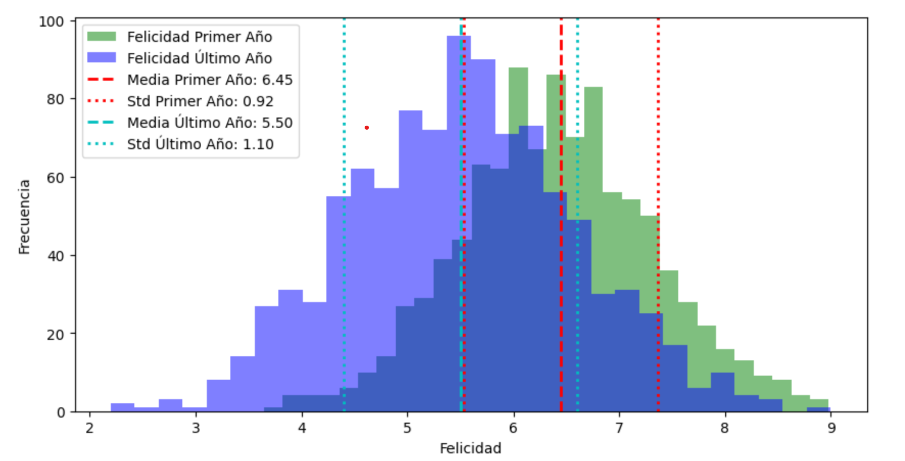

Nombre: Raquel Sierra

**New Dimensions - Python**

**Tarea de la semana 3**

Utilizando los datos sobre la felicidad publicados en español aquí: <https://github.com/cienciadedatos/datos-de-miercoles/tree/master/datos/2019/2019-08-07> van a presentar un reporte que incluya lo siguiente:

1.  **Importamos las bibliotecas necesarias**

``` python
import pandas as pd
import numpy as np
```

2.  **Cargamos los datos desde el repositorio de GitHub**

    ¿Cómo acceden a los datos de la felicidad?

``` python
url = "https://raw.githubusercontent.com/cienciadedatos/datos-de-miercoles/master/datos/2019/2019-08-07/felicidad.csv"
data = pd.read_csv(url)
```

Observamos los datos de nuestra BBDD

``` python
print(data.head())
```

```         
          pais  anio  escalera_vida   log_pib  soporte_social  \
0  Afghanistán  2008       3.723590  7.168690        0.450662   
1  Afghanistán  2009       4.401778  7.333790        0.552308   
2  Afghanistán  2010       4.758381  7.386629        0.539075   
3  Afghanistán  2011       3.831719  7.415019        0.521104   
4  Afghanistán  2012       3.782938  7.517126        0.520637   

   expectativa_vida  libertad  generosidad  percepcion_corrupcion  \
0         50.799999  0.718114     0.177889               0.881686   
1         51.200001  0.678896     0.200178               0.850035   
2         51.599998  0.600127     0.134353               0.706766   
3         51.919998  0.495901     0.172137               0.731109   
4         52.240002  0.530935     0.244273               0.775620   

   afecto_positivo  afecto_negativo  confianza  calidad_democracia  \
0         0.517637         0.258195   0.612072           -1.929690   
1         0.583926         0.237092   0.611545           -2.044093   
2         0.618265         0.275324   0.299357           -1.991810   
3         0.611387         0.267175   0.307386           -1.919018   
4         0.710385         0.267919   0.435440           -1.842996   

   calidad_entrega  de_escalera_pais_anio  gini_banco_mundial  \
0        -1.655084               1.774662                 NaN   
1        -1.635025               1.722688                 NaN   
2        -1.617176               1.878622                 NaN   
3        -1.616221               1.785360                 NaN   
4        -1.404078               1.798283                 NaN   

   gini_banco_mundial_promedio  
0                          NaN  
1                          NaN  
2                          NaN  
3                          NaN  
4                          NaN  
```

Observamos los nombres de las columnas de nuestra BBDD

``` python
nombres_columna = data.columns
print(nombres_columna)
```

```         
Index(['pais', 'anio', 'escalera_vida', 'log_pib', 'soporte_social',
       'expectativa_vida', 'libertad', 'generosidad', 'percepcion_corrupcion',
       'afecto_positivo', 'afecto_negativo', 'confianza', 'calidad_democracia',
       'calidad_entrega', 'de_escalera_pais_anio', 'gini_banco_mundial',
       'gini_banco_mundial_promedio'],
      dtype='object')
```

¿Cómo calculan la medida de tendencia central y dispersión a nivel global para el primer y último año incluido en el set de datos?

``` python
Identificamos el primer (min) y último año (max)
```

``` python
primer_anio = data['anio'].min()
ultimo_anio = data['anio'].max()
```

Identificamos los años que tiene nuestra BBDD

``` python
print(data['anio'].unique())
```

```         
[2008 2009 2010 2011 2012 2013 2014 2015 2016 2017 2018 2007 2006 2005]
```

``` python
# Medida de tendencia central y dispersión de la felicidad a nivel mundial para el primer año (media y std)
```

``` python
media_primer_anio = data[data['anio'] == primer_anio]['escalera_vida'].mean()
std_primer_anio = data[data['anio'] == primer_anio]['escalera_vida'].std()
```

``` python
# Print las medidas (media y std) del primer año
```

``` python
print(f"Medidas (media y std) del primer año:")
print(f"Media: {media_primer_anio}")
print(f"Std: {std_primer_anio}")
```

```         
Medidas (media y std) del primer año:
Media: 6.446164272449635
Std: 0.9191426322726484
```

``` python
# Medida de tendencia central y dispersión de la felicidad a nivel mundial para el último año (media y std)
```

``` python
media_ultimo_anio = data[data['anio'] == ultimo_anio]['escalera_vida'].mean()
std_ultimo_anio = data[data['anio'] == ultimo_anio]['escalera_vida'].std()
```

``` python
# Print las medidas (media y std) de último año
```

``` python
print(f"Medidas (media y std) del último año:")
print(f"Media: {media_ultimo_anio}")
print(f"Std: {std_ultimo_anio}")
```

```         
Medidas (media y std) del último año:
Media: 5.502134340650895
Std: 1.1034612436939357
```

Las medidas estadísticas obtenidas indican que hubo un cambio en los datos del primer al último año. La media del primer año **2005** es 6.446164272449635 con una desviación estándar de 0.9191426322726484, lo que sugiere que los datos estaban relativamente agrupados alrededor de la media. Sin embargo, en el último año **2018**, la media disminuyó a 5.502134340650895 y la desviación estándar aumentó a 1.1034612436939357. Esto podría indicar que los datos del último año están más dispersos y la media es menor en comparación con el primer año.

| Indicadores         | Primer Año (2025)  | Ultimo Año (2018)  |
|---------------------|--------------------|--------------------|
| Media               | 6.446164272449635  | 5.502134340650895  |
| Desviación estandar | 0.9191426322726484 | 1.1034612436939357 |
|                     |                    |                    |

``` python
# Creacion de grafico
```

``` python
!pip install matplotlib
```

```         
Collecting matplotlib
  Obtaining dependency information for matplotlib from https://files.pythonhosted.org/packages/59/c7/f8da659997fe3210fdda689cf2d7720b3a079578fb8aecc3623c4e091a77/matplotlib-3.8.0-cp312-cp312-win_amd64.whl.metadata
  Downloading matplotlib-3.8.0-cp312-cp312-win_amd64.whl.metadata (5.9 kB)
Collecting contourpy>=1.0.1 (from matplotlib)
  Obtaining dependency information for contourpy>=1.0.1 from https://files.pythonhosted.org/packages/75/d4/c3b7a9a0d1f99b528e5a46266b0b9f13aad5a0dd1156d071418df314c427/contourpy-1.1.1-cp312-cp312-win_amd64.whl.metadata
  Downloading contourpy-1.1.1-cp312-cp312-win_amd64.whl.metadata (5.9 kB)
Collecting cycler>=0.10 (from matplotlib)
  Obtaining dependency information for cycler>=0.10 from https://files.pythonhosted.org/packages/e7/05/c19819d5e3d95294a6f5947fb9b9629efb316b96de511b418c53d245aae6/cycler-0.12.1-py3-none-any.whl.metadata
  Downloading cycler-0.12.1-py3-none-any.whl.metadata (3.8 kB)
Collecting fonttools>=4.22.0 (from matplotlib)
  Obtaining dependency information for fonttools>=4.22.0 from https://files.pythonhosted.org/packages/24/01/9bb5e115206b5c7f7894978f9af57a3d17c94fbc0df913389f1eaf334a68/fonttools-4.43.1-cp312-cp312-win_amd64.whl.metadata
  Downloading fonttools-4.43.1-cp312-cp312-win_amd64.whl.metadata (155 kB)
     ---------------------------------------- 0.0/155.5 kB ? eta -:--:--
     ---------------------------------------- 0.0/155.5 kB ? eta -:--:--
     -- ------------------------------------- 10.2/155.5 kB ? eta -:--:--
     ------- ----------------------------- 30.7/155.5 kB 435.7 kB/s eta 0:00:01
     ------- ----------------------------- 30.7/155.5 kB 435.7 kB/s eta 0:00:01
     ------- ----------------------------- 30.7/155.5 kB 435.7 kB/s eta 0:00:01
     -------------------------- --------- 112.6/155.5 kB 547.6 kB/s eta 0:00:01
     -------------------------- --------- 112.6/155.5 kB 547.6 kB/s eta 0:00:01
     -------------------------- --------- 112.6/155.5 kB 547.6 kB/s eta 0:00:01
     ------------------------------------ 155.5/155.5 kB 422.4 kB/s eta 0:00:00
Collecting kiwisolver>=1.0.1 (from matplotlib)
  Obtaining dependency information for kiwisolver>=1.0.1 from https://files.pythonhosted.org/packages/63/50/2746566bdf4a6a842d117367d05c90cfb87ac04e9e2845aa1fa21f071362/kiwisolver-1.4.5-cp312-cp312-win_amd64.whl.metadata
  Downloading kiwisolver-1.4.5-cp312-cp312-win_amd64.whl.metadata (6.5 kB)
Requirement already satisfied: numpy<2,>=1.21 in c:\users\rachel sierra\miniconda3\envs\new_dimensions\lib\site-packages (from matplotlib) (1.26.0)
Requirement already satisfied: packaging>=20.0 in c:\users\rachel sierra\miniconda3\envs\new_dimensions\lib\site-packages (from matplotlib) (23.2)
Collecting pillow>=6.2.0 (from matplotlib)
  Obtaining dependency information for pillow>=6.2.0 from https://files.pythonhosted.org/packages/00/00/d42abea0b4a415ea1e0975c981f95f354de1280d7e7bef3882bf1464b795/Pillow-10.0.1-cp312-cp312-win_amd64.whl.metadata
  Downloading Pillow-10.0.1-cp312-cp312-win_amd64.whl.metadata (9.6 kB)
Collecting pyparsing>=2.3.1 (from matplotlib)
  Obtaining dependency information for pyparsing>=2.3.1 from https://files.pythonhosted.org/packages/39/92/8486ede85fcc088f1b3dba4ce92dd29d126fd96b0008ea213167940a2475/pyparsing-3.1.1-py3-none-any.whl.metadata
  Downloading pyparsing-3.1.1-py3-none-any.whl.metadata (5.1 kB)
Requirement already satisfied: python-dateutil>=2.7 in c:\users\rachel sierra\miniconda3\envs\new_dimensions\lib\site-packages (from matplotlib) (2.8.2)
Requirement already satisfied: six>=1.5 in c:\users\rachel sierra\miniconda3\envs\new_dimensions\lib\site-packages (from python-dateutil>=2.7->matplotlib) (1.16.0)
Downloading matplotlib-3.8.0-cp312-cp312-win_amd64.whl (7.6 MB)
   ---------------------------------------- 0.0/7.6 MB ? eta -:--:--
    --------------------------------------- 0.1/7.6 MB 3.3 MB/s eta 0:00:03
   - -------------------------------------- 0.2/7.6 MB 2.9 MB/s eta 0:00:03
   - -------------------------------------- 0.2/7.6 MB 2.9 MB/s eta 0:00:03
   -- ------------------------------------- 0.5/7.6 MB 2.7 MB/s eta 0:00:03
   --- ------------------------------------ 0.6/7.6 MB 2.8 MB/s eta 0:00:03
   ---- ----------------------------------- 0.9/7.6 MB 3.3 MB/s eta 0:00:03
   ------- -------------------------------- 1.4/7.6 MB 4.2 MB/s eta 0:00:02
   -------- ------------------------------- 1.6/7.6 MB 4.1 MB/s eta 0:00:02
   ----------- ---------------------------- 2.1/7.6 MB 5.0 MB/s eta 0:00:02
   ------------ --------------------------- 2.4/7.6 MB 5.5 MB/s eta 0:00:01
   ------------------ --------------------- 3.5/7.6 MB 6.7 MB/s eta 0:00:01
   ----------------------- ---------------- 4.5/7.6 MB 8.2 MB/s eta 0:00:01
   ------------------------- -------------- 4.8/7.6 MB 7.9 MB/s eta 0:00:01
   -------------------------------- ------- 6.3/7.6 MB 9.6 MB/s eta 0:00:01
   ---------------------------------------  7.6/7.6 MB 10.9 MB/s eta 0:00:01
   ---------------------------------------- 7.6/7.6 MB 10.2 MB/s eta 0:00:00
Downloading contourpy-1.1.1-cp312-cp312-win_amd64.whl (486 kB)
   ---------------------------------------- 0.0/486.7 kB ? eta -:--:--
   --------------------------------------- 486.7/486.7 kB 15.4 MB/s eta 0:00:00
Downloading cycler-0.12.1-py3-none-any.whl (8.3 kB)
Downloading fonttools-4.43.1-cp312-cp312-win_amd64.whl (2.1 MB)
   ---------------------------------------- 0.0/2.1 MB ? eta -:--:--
   ----------------------------- ---------- 1.6/2.1 MB 51.2 MB/s eta 0:00:01
   ---------------------------------------- 2.1/2.1 MB 27.2 MB/s eta 0:00:00
Downloading kiwisolver-1.4.5-cp312-cp312-win_amd64.whl (56 kB)
   ---------------------------------------- 0.0/56.0 kB ? eta -:--:--
   ---------------------------------------- 56.0/56.0 kB 3.1 MB/s eta 0:00:00
Downloading Pillow-10.0.1-cp312-cp312-win_amd64.whl (2.5 MB)
   ---------------------------------------- 0.0/2.5 MB ? eta -:--:--
   ------------------------ --------------- 1.6/2.5 MB 33.1 MB/s eta 0:00:01
   ---------------------------------------  2.5/2.5 MB 39.7 MB/s eta 0:00:01
   ---------------------------------------- 2.5/2.5 MB 23.0 MB/s eta 0:00:00
Downloading pyparsing-3.1.1-py3-none-any.whl (103 kB)
   ---------------------------------------- 0.0/103.1 kB ? eta -:--:--
   ---------------------------------------- 103.1/103.1 kB ? eta 0:00:00
Installing collected packages: pyparsing, pillow, kiwisolver, fonttools, cycler, contourpy, matplotlib
Successfully installed contourpy-1.1.1 cycler-0.12.1 fonttools-4.43.1 kiwisolver-1.4.5 matplotlib-3.8.0 pillow-10.0.1 pyparsing-3.1.1
```

``` python
import matplotlib.pyplot as plt
```

``` python
# Creación datos de ejemplo para el gráfico
np.random.seed(0)
felicidad_primer_anio = np.random.normal(media_primer_anio, std_primer_anio, 1000)
felicidad_ultimo_anio = np.random.normal(media_ultimo_anio, std_ultimo_anio, 1000)
```

``` python
# Crear el gráfico
plt.figure(figsize=(10,5))
plt.hist(felicidad_primer_anio, bins=30, alpha=0.5, color='g', label='Felicidad Primer Año')
plt.hist(felicidad_ultimo_anio, bins=30, alpha=0.5, color='b', label='Felicidad Último Año')
plt.axvline(media_primer_anio, color='r', linestyle='dashed', linewidth=2, label=f'Media Primer Año: {media_primer_anio:.2f}')
plt.axvline(media_primer_anio + std_primer_anio, color='r', linestyle='dotted', linewidth=2, label=f'Std Primer Año: {std_primer_anio:.2f}')
plt.axvline(media_primer_anio - std_primer_anio, color='r', linestyle='dotted', linewidth=2)
plt.axvline(media_ultimo_anio, color='c', linestyle='dashed', linewidth=2, label=f'Media Último Año: {media_ultimo_anio:.2f}')
plt.axvline(media_ultimo_anio + std_ultimo_anio, color='c', linestyle='dotted', linewidth=2, label=f'Std Último Año: {std_ultimo_anio:.2f}')
plt.axvline(media_ultimo_anio - std_ultimo_anio, color='c', linestyle='dotted', linewidth=2)
plt.xlabel('Felicidad')
plt.ylabel('Frecuencia')
plt.legend()
plt.show()
```


Pala la elección de los paises, observamos los paises que se encuentran en nuestr BBDD

``` python
print(data['pais'].unique())
```

```         
['Afghanistán' 'Albania' 'Algeria' 'Angola' 'Argentina' 'Armenia'
 'Australia' 'Austria' 'Azerbaijan' 'Bahrain' 'Bangladesh' 'Bielorrusia'
 'Bélgica' 'Belize' 'Benin' 'Bhutan' 'Bolivia' 'Bosnia y Herzegovina'
 'Botswana' 'Brasil' 'Bulgaria' 'Burkina Faso' 'Burundi' 'Cambodia'
 'Camerún' 'Canadá' 'República Central Africana' 'Chad' 'Chile' 'China'
 'Colombia' 'Comoros' 'Congo (Brazzaville)' 'Congo (Kinshasa)'
 'Costa Rica' 'Croacia' 'Cuba' 'Chipre' 'República Checa' 'Dinamarca'
 'Djibouti' 'República Dominicana' 'Ecuador' 'Egipto' 'El Salvador'
 'Estonia' 'Etiopía' 'Finlandia' 'Francia' 'Gabón' 'Gambia' 'Georgia'
 'Alemania' 'Ghana' 'Greece' 'Guatemala' 'Guinea' 'Guyana' 'Haití'
 'Honduras' 'Hong Kong S.A.R. of China' 'Hungría' 'Islandia' 'India'
 'Indonesia' 'Iran' 'Irak' 'Irlanda' 'Israel' 'Italia' 'Costa de Marfil'
 'Jamaica' 'Japón' 'Jordania' 'Kazakhstan' 'Kenia' 'Kosovo' 'Kuwait'
 'Kyrgyzstan' 'Laos' 'Latvia' 'Líbano' 'Lesotho' 'Liberia' 'Libya'
 'Lituania' 'Luxemburgo' 'Macedonia' 'Madagascar' 'Malawi' 'Malasia'
 'Mali' 'Malta' 'Mauritania' 'Mauritius' 'México' 'Moldova' 'Mongolia'
 'Montenegro' 'Marruecos' 'Mozambique' 'Myanmar' 'Namibia' 'Nepal'
 'Países Bajos' 'Nueva Zelanda' 'Nicaragua' 'Nigeria' 'North Cyprus'
 'Noruega' 'Oman' 'Pakistan' 'Palestinian Territories' 'Panamá' 'Paraguay'
 'Perú' 'Filipinas' 'Polonia' 'Portugal' 'Qatar' 'Rumania' 'Rusia'
 'Ruanda' 'Arabia Saudita' 'Senegal' 'Serbia' 'Sierra Leona' 'Singapur'
 'Eslovaquia' 'Eslovenia' 'Somalía' 'Somaliland region' 'Sudáfrica'
 'Corea del Sur' 'South Sudan' 'España' 'Sri Lanka' 'Sudan' 'Surinam'
 'Swaziland' 'Suecia' 'Suiza' 'Syria' 'Taiwán' 'Tajikistan' 'Tanzania'
 'Tailandia' 'Togo' 'Trinidad y Tobago' 'Túnez' 'Turquía' 'Turkmenistan'
 'Uganda' 'Ucrania' 'Emiratos Árabes Unidos' 'Reino Unido'
 'Estados Unidos' 'Uruguay' 'Uzbekistan' 'Venezuela' 'Vietnam' 'Yemen'
 'Zambia' 'Zimbabue']
```

``` python
# Accedemos a la información de la felicidad del primer y último año para los dos países de nuestra elección
pais1 = 'Bélgica'
pais2 = 'Australia'
```

``` python
# Filtrar datos para el primer año y los países seleccionados
felicidad_pais1_primer_anio_data = data[(data['anio'] == primer_anio) & (data['pais'] == pais1)]['escalera_vida']

if len(felicidad_pais1_primer_anio_data) > 0:
    felicidad_pais1_primer_anio = felicidad_pais1_primer_anio_data.values[0]
else:
    print(f"No se encontraron datos para el país {pais1} en el primer año.")
```

``` python
# Filtrar datos para del primer año y los países seleccionados
felicidad_pais1_primer_anio = data[(data['anio'] == primer_anio) & (data['pais'] == pais1)]['escalera_vida'].values[0]
felicidad_pais2_primer_anio = data[(data['anio'] == primer_anio) & (data['pais'] == pais2)]['escalera_vida'].values[0]
```

``` python
# Filtrar datos para el ultimo año y los países seleccionados
felicidad_pais1_ultimo_anio = data[(data['anio'] == ultimo_anio) & (data['pais'] == pais1)]['escalera_vida'].values[0]
felicidad_pais2_ultimo_anio = data[(data['anio'] == ultimo_anio) & (data['pais'] == pais2)]['escalera_vida'].values[0]
```

``` python
# Identidicar los niveles de felicidad de los países seleccionados
print(f"Felicidad en {pais1} en el primer año (2005): {felicidad_pais1_primer_anio}")
print(f"Felicidad en {pais2} en el primer año (2005): {felicidad_pais2_primer_anio}")
print(f"Felicidad en {pais1} en el último año (2018): {felicidad_pais1_ultimo_anio}")
print(f"Felicidad en {pais2} en el último año (2018): {felicidad_pais2_ultimo_anio}")
```

```         
Felicidad en Bélgica en el primer año (2005): 7.262290477752685
Felicidad en Australia en el primer año (2005): 7.340688228607178
Felicidad en Bélgica en el último año (2018): 6.892171859741211
Felicidad en Australia en el último año (2018): 7.176993370056152
```

``` python
# Comparamos los países de nuestra elección con el resto del mundo
if felicidad_pais1_primer_anio > media_primer_anio:
    comparacion_pais1_primer_anio = f"{pais1} fue más feliz que el promedio del resto del mundo en el primer año (2005)."
else:
    comparacion_pais1_primer_anio = f"{pais1} es menos feliz que el promedio del resto del mundo en el primer año (2005)."

if felicidad_pais1_ultimo_anio > media_ultimo_anio:
    comparacion_pais1_ultimo_anio = f"{pais1} fue más feliz que el promedio del resto del mundo en el último año (2018)."
else:
    comparacion_pais1_ultimo_anio = f"{pais1} fue menos feliz que el promedio del resto del mundo en el último año (2018)."

if felicidad_pais2_primer_anio > media_primer_anio:
    comparacion_pais2_primer_anio = f"{pais2} fue más feliz que el promedio del resto del mundo en el primer año (2005)."
else:
    comparacion_pais2_primer_anio = f"{pais2} es menos feliz que el promedio del resto del mundo en el primer año (2005)."

if felicidad_pais2_ultimo_anio > media_ultimo_anio:
    comparacion_pais2_ultimo_anio = f"{pais2} fue más feliz que el promedio del resto del mundo en el último año (2018)."
else:
    comparacion_pais2_ultimo_anio = f"{pais2} fue menos feliz que el promedio del resto del mundo en el último año (2018)."
```

``` python
# Print las comparaciones
print(comparacion_pais1_primer_anio)
print(comparacion_pais1_ultimo_anio)
print(comparacion_pais2_primer_anio)
print(comparacion_pais2_ultimo_anio)
```

Los datos obtenidos indican que la felicidad en Bélgica y Australia ha cambiado entre el primer 2005 y último año 2018. En 2005, la felicidad en Bélgica era de 7.26 y en Australia era de 7.34. Sin embargo, en 2018, la felicidad en Bélgica disminuyó a 6.89, mientras que en Australia disminuyó a 7.18.

En cuanto a las medidas del último año, la media fue de 5.50 y la desviación estándar fue de 1.10. Esto sugiere que hubo una variación significativa en los niveles de felicidad entre diferentes paises durante el tiempo.

Estos datos pueden ser útiles para entender cómo la felicidad ha cambiado con el tiempo en diferentes paises y cómo se compara con la media global.

```         
Bélgica fue más feliz que el promedio del resto del mundo en el primer año (2005).
Bélgica fue más feliz que el promedio del resto del mundo en el último año (2018).
Australia fue más feliz que el promedio del resto del mundo en el primer año (2005).
Australia fue más feliz que el promedio del resto del mundo en el último año (2018).
```
